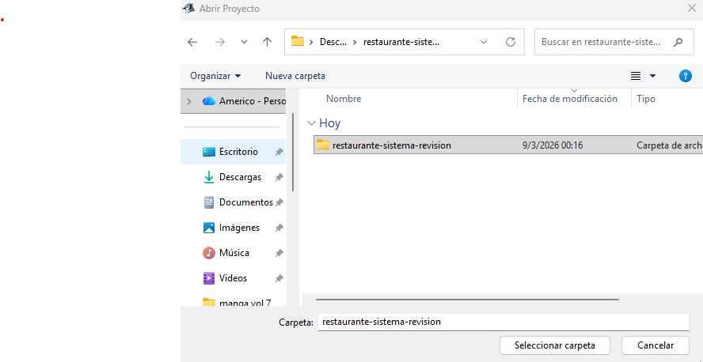
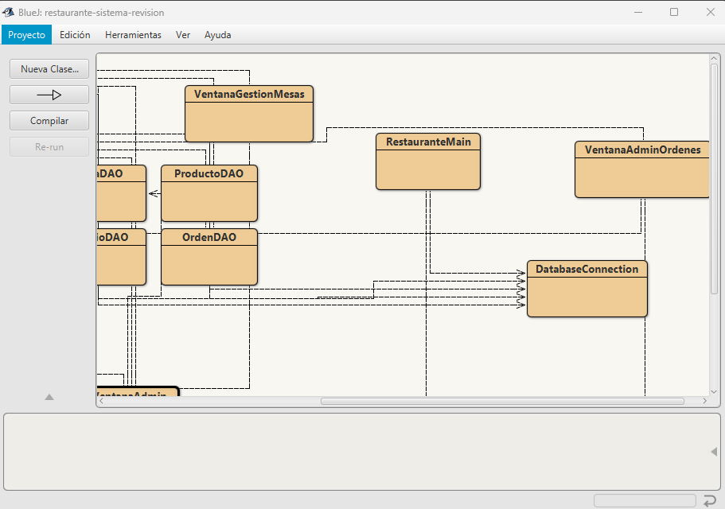
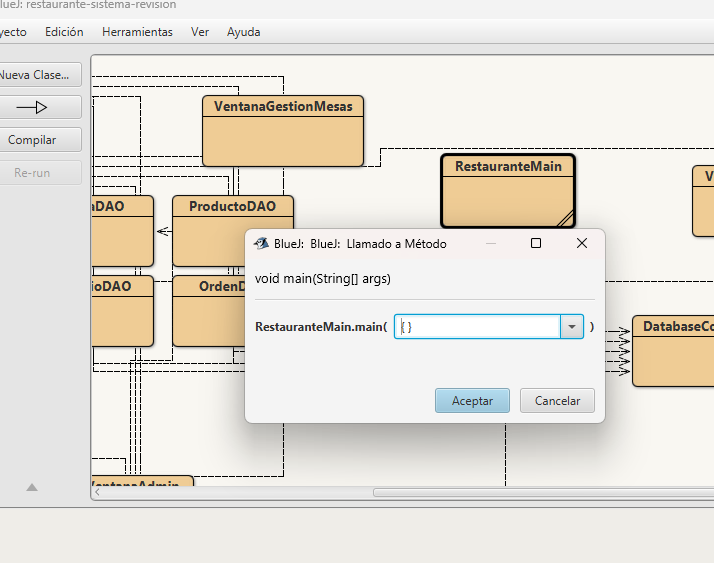
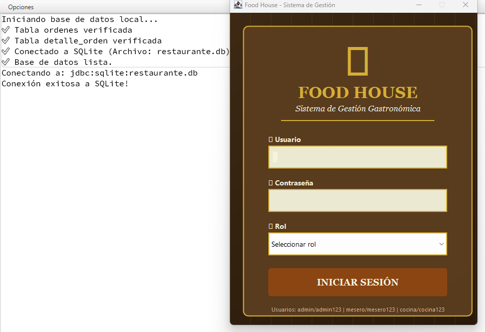
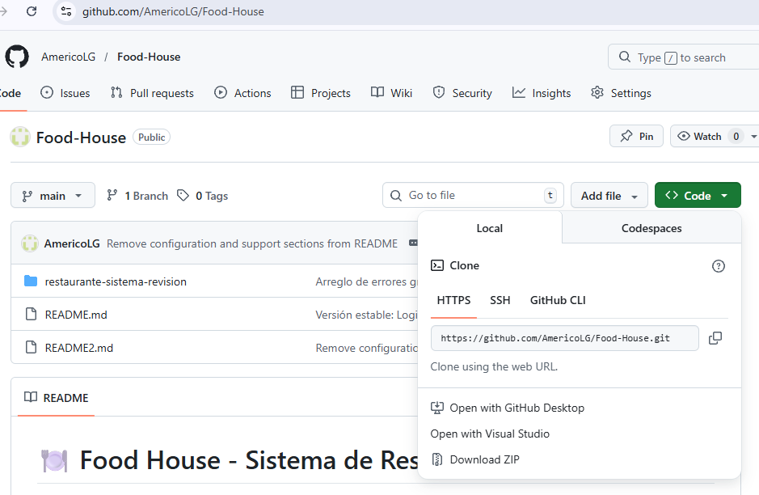

# 🛠️ Manual Técnico de Instalación - Food House

Este documento describe los requerimientos, la arquitectura de persistencia y el flujo de despliegue necesario para el entorno de desarrollo del sistema.

---

## 🏗️ Especificaciones del Sistema

El sistema está construido bajo una arquitectura monolítica en **Java**, utilizando **SQLite** como motor de base de datos embebido para eliminar la necesidad de un servidor de base de datos externo.

* **Lenguaje:** Java 8 o superior.
* **IDE:** BlueJ (Recomendado por su gestión visual de objetos).
* **Persistencia:** Driver JDBC para SQLite.
* **Gestión de Datos:** Archivo local `.db`.

---

## 🔧 Configuración del Entorno y Despliegue

### 1. Obtención del Código Fuente
Asegúrese de clonar o descargar el repositorio completo. La integridad de la carpeta `/images` es vital para la documentación visual, y la raíz debe contener los archivos `.java` y `.bluej`.

### 2. Carga del Proyecto en el IDE
Al abrir el archivo `package.bluej`, el entorno cargará el diagrama de clases. Es fundamental verificar que todas las relaciones (flechas de herencia y dependencia) se visualicen correctamente antes de compilar.

### 3. Configuración de Librerías Externas (Crítico)
Para que la comunicación con la base de datos sea exitosa, el driver JDBC debe estar vinculado globalmente en el IDE:
1.  Vaya a **Tools** -> **Preferences** -> **Libraries**.
2.  Haga clic en **Add** y seleccione el archivo `sqlite-jdbc-x.x.x.jar`.
3.  **Reinicie el IDE** para que los cambios en el Classpath surtan efecto.

### 4. Inicialización y Punto de Entrada
La lógica de arranque reside en la clase `RestauranteMain`. Al ejecutar el método `main(String[] args)`, el sistema realiza las siguientes tareas automáticas:
* Verificación de conexión con el driver.
* Creación del archivo `restaurante.db` si no existe.
* Ejecución de scripts DDL para la creación de tablas.

---

## 🔑 Control de Acceso (RBAC)

El sistema utiliza un control de acceso basado en roles para segmentar las funciones técnicas. Las credenciales de prueba integradas en la lógica de inicialización son:

| Rol Técnico | Usuario | Contraseña | Alcance |
| :--- | :--- | :--- | :--- |
| **Administrador** | `admin` | `admin123` | Gestión de Inventario, Empleados y Reportes. |
| **Mesero** | `mesero` | `mesero123` | Gestión de Pedidos, Mesas y Facturación. |
| **Cocinero** | `cocina` | `cocina123` | Gestión de Comandas y Estados de Producción. |

---

## ⚠️ Notas Técnicas y Mantenimiento
* **Reset de Datos:** Para limpiar la base de datos, elimine el archivo `restaurante.db` en la carpeta raíz. El sistema lo regenerará vacío en la próxima ejecución.
* **Concurrencia:** SQLite bloquea el archivo durante operaciones de escritura. Asegúrese de no tener el archivo `.db` abierto en un gestor externo (como DB Browser) mientras corre el programa.