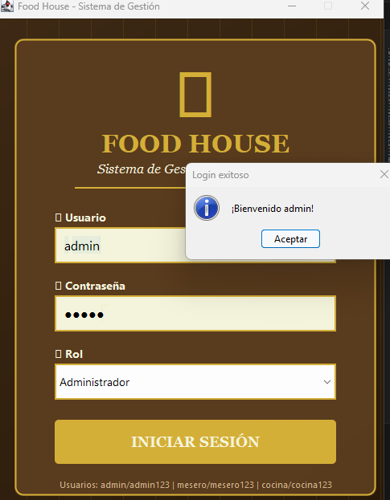
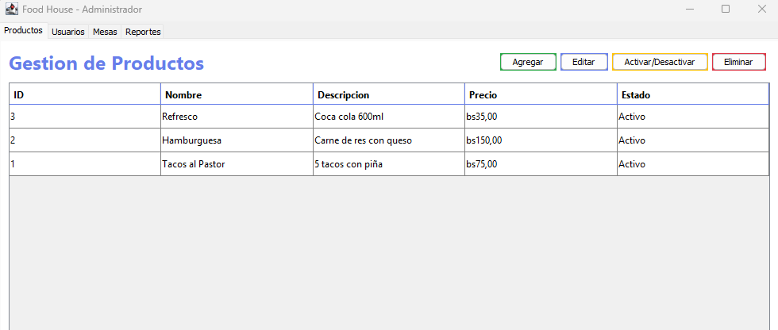
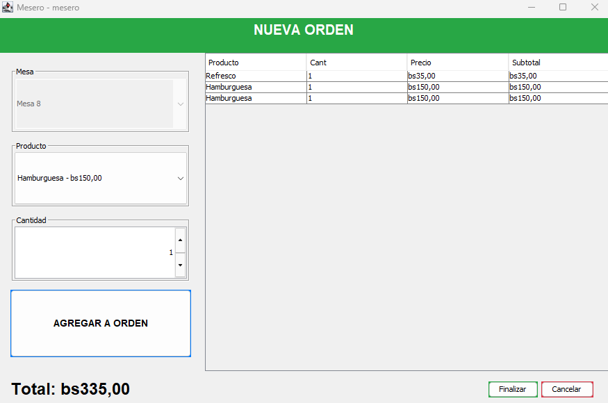
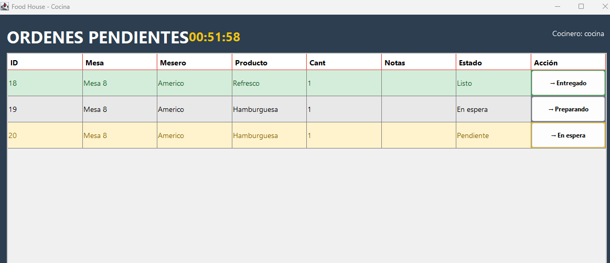
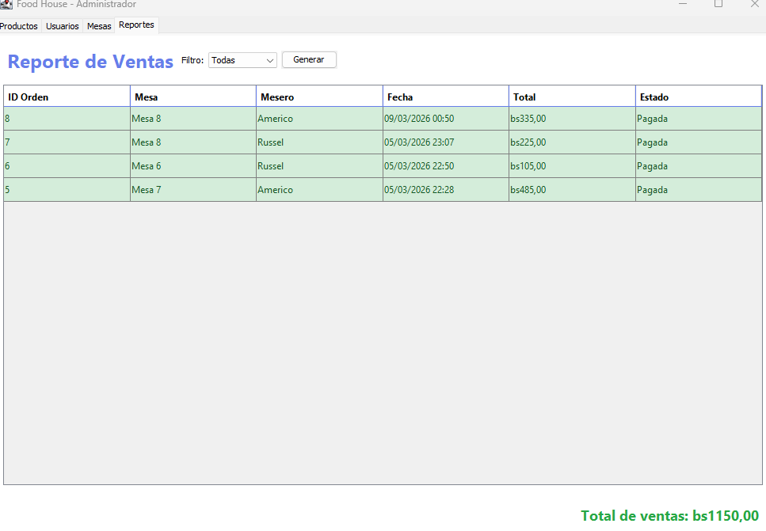

# 📖 Manual de Usuario - Food House

Este manual describe el flujo operativo y las funcionalidades de la interfaz para los distintos roles del sistema.

---

## 🔐 Acceso al Sistema

El sistema cuenta con tres perfiles de acceso preconfigurados. Seleccione su rol e ingrese las credenciales correspondientes en la pantalla de inicio.

| Rol | Usuario | Contraseña | Alcance |
|:---|:---|:---|:---|
| **Administrador** | `admin` | `admin123` | Gestión total, inventario y reportes. |
| **Mesero** | `mesero` | `mesero123` | Control de mesas y toma de pedidos. |
| **Cocinero** | `cocina` | `cocina123` | Gestión de comandas y estados. |

---

## 🎛️ Panel de Administración

Diseñado para el control estratégico del establecimiento.

### Gestión de Inventario y Personal
* **Productos:** Permite añadir, editar o dar de baja elementos del menú, ajustando precios y stock en tiempo real.
* **Empleados:** Registro y control de los usuarios con acceso al sistema.
* **Reportes:** Visualización de métricas de ventas y ranking de productos más solicitados.

---

## 🍽️ Panel de Mesero

Optimizado para una atención rápida en el salón.

### Flujo de Atención
1.  **Mapa de Mesas:** Identifique visualmente la disponibilidad (Libre/Ocupada).
2.  **Toma de Pedido:** Seleccione la mesa y añada productos al carrito. El sistema calcula el subtotal automáticamente.
3.  **Envío a Cocina:** Una vez confirmado, el pedido se transfiere instantáneamente al panel del cocinero.

---

## 👨‍🍳 Panel de Cocina

Interfaz simplificada para el flujo de preparación.

### Gestión de Comandas
* **Monitor de Órdenes:** Listado prioritario de pedidos pendientes.
* **Cambio de Estado:** El cocinero marca el pedido como **Listo** para que el mesero reciba la notificación de servicio.

---

## 🎯 Flujo de Trabajo Diario

### 1. Atención y Pedido
El mesero asigna la mesa y envía la comanda. El sistema descuenta temporalmente los insumos del inventario.

### 2. Preparación
Cocina visualiza la orden, prepara los platillos y cambia el estado a "Listo".

### 3. Pago y Cierre
El mesero procesa el pago de la cuenta. Al finalizar, la mesa se libera automáticamente y se consolida la venta en el reporte del administrador.

---

## 💡 Tips de Uso
* **Refresco:** El sistema actualiza los estados de las mesas automáticamente.
* **Seguridad:** Recuerde cerrar sesión al finalizar su turno para proteger la integridad de los reportes.
* **Base de Datos:** El sistema guarda cada transacción al instante; no es necesario un botón de "Guardar todo".